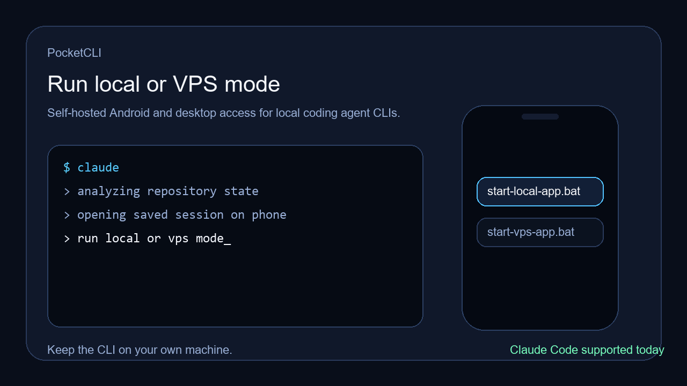

# PocketCLI

Self-hosted Android and desktop access for local coding agent CLIs.



PocketCLI lets you keep your agent CLI running on your own machine and reach it from:

- a local browser
- a Windows desktop launcher
- an Android app
- a VPS-backed public endpoint

Claude Code and Codex CLI work today. More local agent CLIs can fit the same workflow later.

Real screenshots are still being refreshed. For now, the README only keeps the real demo asset instead of placeholder illustrations. See [docs/screenshots.md](docs/screenshots.md) for the capture plan.

## Quick Start

### 1. Local mode

```bat
npm install
start-local-app.bat
```

Open:

- `http://127.0.0.1:3000`

### 2. VPS mode

1. Copy [config/vps.example.json](config/vps.example.json) to `config/vps.json`
2. Fill in your VPS host, SSH user, SSH key path, reverse port, and public URL
3. Run:

```bat
start-vps-app.bat
```

The script will:

- start the local server
- prepare an access token
- configure `nginx` on the VPS
- create the reverse SSH tunnel
- print the public URL and token

### 2.1 Supported CLI presets

The browser UI includes built-in startup presets for:

- `Claude Code`
- `Codex CLI`

You can still leave the preset on `Custom startup` and run any other local CLI command manually.

### 3. Android install

Build:

```bat
build-apk.bat
```

The build script auto-detects a local Android SDK from `ANDROID_SDK_ROOT`, `ANDROID_HOME`, `C:\gps_android_sdk`, or `%LOCALAPPDATA%\Android\Sdk`.

Outputs:

- `dist/android/app-debug.apk`
- `dist/android/app-release.apk` when `android/keystore.properties` exists
- `dist/checksums.txt`

## Why PocketCLI

- Keep your own machine as the execution host
- Reach local sessions from phone or desktop
- Use the existing CLI interaction model instead of rebuilding it as chat UI
- Choose local-only, LAN, temporary public tunnel, or VPS-backed access
- Stay self-hosted and simple

## Features

- Multi-session terminal UI in the browser with `xterm.js`
- Local sessions with `node-pty`
- SSH sessions with `ssh2`
- Built-in startup presets and quick actions for Claude Code and Codex CLI
- Android shell app with saved address, token, language, and first-run setup
- Windows desktop launcher for local, LAN, and VPS modes
- Token-protected public mode
- One-command startup scripts for the common paths

## Run Modes

### Local

- Script: [start-local-app.bat](start-local-app.bat)
- Binds to `127.0.0.1:3000`
- Opens the local UI automatically

### LAN

- Script: [start-lan.bat](start-lan.bat)
- Binds to `0.0.0.0:3000`
- Prints the detected LAN URL for phones and tablets

### Temporary public tunnel

- Script: [start-public-app.bat](start-public-app.bat)
- Uses `localhost.run` first
- Falls back to `cloudflared`
- Best for quick sharing and personal testing

### VPS public endpoint

- Script: [start-vps-app.bat](start-vps-app.bat)
- Uses your own VPS as the stable public entrypoint
- Requires a local `config/vps.json`
- Protects public access with a saved token

## Android

The Android app is intentionally a native shell around the existing terminal page.

- Full-screen terminal view
- First-run setup gate
- Saved server address and token
- Manual language switch
- Minimal drawer instead of exposed browser chrome

The goal is to stay close to the CLI interaction model, not to replace it.

## Desktop

The desktop launcher wraps the existing web UI and startup scripts.

- Start local, LAN, and VPS modes
- Stop the running server
- Read the current VPS URL and token from runtime files
- Load the web UI without remembering manual commands

Run:

```bat
start-desktop.bat
```

## Security Notes

- Local and LAN modes do not enforce login by default
- Public access relies on the generated access token
- Keep `config/vps.json`, `.secrets/`, and private keys out of source control
- `ignore TLS errors` in the Android app is only for personal testing with self-signed HTTPS

## Project Layout

- [server/server.js](server/server.js): session server, auth, REST, WebSocket
- [public/](public): browser terminal UI
- [desktop/](desktop): Electron desktop launcher
- [android/](android): Android app project
- [scripts/](scripts): startup helpers, VPS helpers, build helpers
- [docs/](docs): public docs, launch assets, release checklist

## Build and Release

- APK build: [build-apk.bat](build-apk.bat)
- Release signing template: [android/keystore.properties.example](android/keystore.properties.example)
- SHA256 output helper: [scripts/write-checksums.ps1](scripts/write-checksums.ps1)
- Release checklist: [docs/release-checklist.md](docs/release-checklist.md)
- Release notes template: [docs/release-notes-v0.1.0.md](docs/release-notes-v0.1.0.md)

## Roadmap

- Better screenshot and demo capture pipeline
- HTTPS-first public deployment guide
- Optional presets for common agent CLIs
- Better session presets for projects and startup commands

## Chinese Docs

- [Chinese guide](docs/zh-CN.md)

## Community

- [Contributing guide](CONTRIBUTING.md)
- [Security policy](SECURITY.md)
- [Support guide](SUPPORT.md)
- [Code of conduct](CODE_OF_CONDUCT.md)

## License

[MIT](LICENSE)
